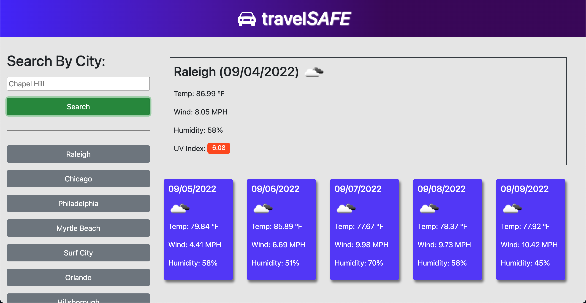

# travelSAFE

'travelSAFE' is a weather dashboard application that works by typing a city name into the search input. When the search button is clicked, and if there is a valid city name in the input, data is requested from the Open Weather API for the specified city. Specific data is then displayed to the screen.

If using a device with a large viewport, the current weather will be displayed in the top right hand section of the screen after a successful search. If on a mobile device, the window will take on a column design for better readability, and the search history section is removed for smaller devices.

## Developer Notes

travelSAFE uses 3 different API URLs to make calls for data retrieval. These data responses fall into 3 different groups:

- Current Weather
- UV Index
- Forecasted Weather

### Problems:

The UV Index value returned after the fetch seems to be too high. To get the UV closer to normal levels for demonstration purposes, the UV Index is reduced by 3 so the value more closely resemble current UV levels.

## Application Photo

## Built With

- HTML
- CSS
- JavaScript
- Moment.js
- Bootstrap
- Open Weather API

### Website

https://tguy5837.github.io/travelSafe/

### GitHub Repository

https://github.com/tguy5837/travelSafe

## Contribution

Created by Taylor Guy
